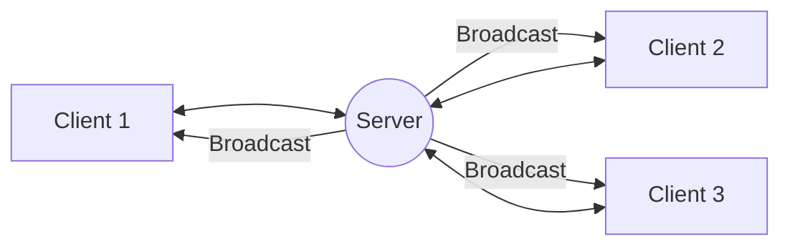

# Socket-Based Chat Application

## Project Overview
This is a real-time, multi-client chat application built using **Python Sockets** and **Multithreading**. It follows a **Client-Server architecture** where a central server manages multiple clients, allowing them to communicate in a shared chat room.
https://chat--application.streamlit.app/


## Technologies Used
- **Language:** Python 3
- **Networking:** TCP Sockets (`socket` library)
- **Concurrency:** Multithreading (`threading` library)

## System Architecture
The application follows a star topology where all clients communicate through a central server.


- **Clients:** Send messages to the server and receive broadcasted messages.
- **Server:** Manages connections, receives messages from one client, and forwards them to all others.

## File Structure
- `server.py`: The heart of the application. It handles incoming connections, maintains a list of users, and broadcasts messages.
- `client.py`: The program run by users. It connects to the server and handles sending/receiving messages using threads.
- `screenshots/`: Folder to store visual proof of the application running.

## How to Run

### 1. Start the Server
Open a terminal and run:
```bash
python server.py
```

### 2. Start Multiple Clients
Open two or more additional terminals and run:
```bash
python client.py
```

### 3. Streamlit Interface (Modern Web)
Requires `streamlit`.
```bash
pip install streamlit
streamlit run streamlit_app.py
```

## How to Chat
1. **TCP Version**: Run `server.py` then multiple `client.py` instances.
2. **Web Version**: Run `web_server.py` and visit `localhost:8000`.
## How to Chat between Different Systems (LAN/WiFi)
1. **Host PC (The Server)**:
   - Run `streamlit run streamlit_app.py`.
   - Copy the "Network URL" (e.g., `http://192.168.x.x:8501`).
2. **Client PC (Your Friends)**:
   - Don't run any code! Just open a browser.
   - Enter the "Network URL" provided by the Host.
   - You are now connected to the same centralized database!

## Networking Concepts Applied
- **TCP (Transmission Control Protocol):** Ensures reliable, ordered delivery of messages.
- **Port Binding:** The server biological "listens" on a specific port (5000) for incoming traffic.
- **Threaded Handling:** Each client connection is handled by a separate thread on the server, ensuring no single user blocks the entire system.

